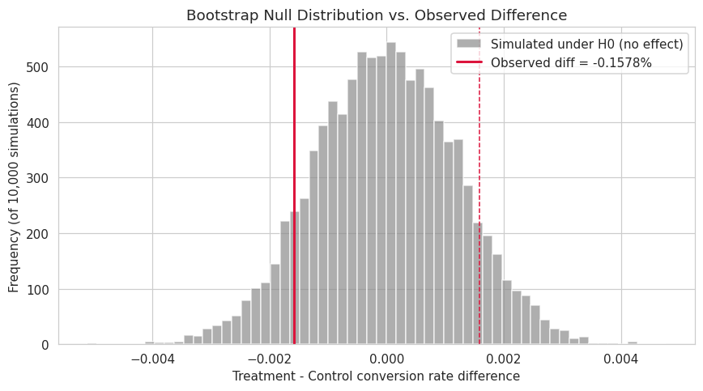

# Should We Ship the New Landing Page?

*A statistical validation of the e-commerce A/B test results, prepared for a non-technical stakeholder audience.*

---

## Executive Summary

The product team ran an experiment: half of visitors saw the existing landing page (control), and half saw a redesigned version (treatment). The goal was to find out whether the new page converts more visitors into customers.

We tested this four different statistical ways to make sure the conclusion isn't an accident of any one method. All four agree on the same answer:

> ### 🔴 VERDICT: The new page does NOT convert better than the old page. Do not ship it based on this data.

With nearly 300,000 visitor sessions in this dataset, we had more than enough data to catch even a small real improvement, if one existed. The tests didn't find one — the honest read is that the two pages perform the same, not that we lack the data to tell.

---

## 1. The Business Question

Every visitor was randomly shown either the old page ("control") or the new page ("treatment"), and we recorded whether they converted (completed a purchase). The question: is the difference in conversion rate between these two groups real, or could it just as easily be explained by chance?

This matters because a wrong call is expensive either way — shipping a redesign that isn't actually better wastes engineering effort, while sitting on a genuinely better page leaves revenue on the table.

---

## 2. What the Numbers Show

Control converted at **12.07%** of sessions; treatment converted at **12.05%** — a gap of about 0.02 percentage points, smaller than the margin of error shown by the error bars above. That's the first sign this difference isn't meaningful.

---

## 3. Four Independent Statistical Tests

Each test looks at the same question from a different angle. If they disagreed with each other, that disagreement would itself be worth investigating — but here, they line up.

| Test | What it checks | p-value | Decision (α = 0.05) |
|---|---|---|---|
| Chi-square (independence) | Is conversion associated with page? | 0.874 | Fail to reject H₀ |
| Welch's t-test | Do mean conversion rates differ? | 0.869 | Fail to reject H₀ |
| One-way ANOVA | Does conversion vary by day of week? | 0.013 | Reject H₀* |
| Bootstrap (10,000 iters) | Empirical CI on the rate difference | 0.870 | Fail to reject H₀ |

- **Chi-square test:** checks whether conversion and "which page you saw" are statistically linked at all. p = 0.874 — no link detected.
- **t-test:** checks whether the average conversion rate genuinely differs between the two groups. p = 0.869 — no meaningful difference.
- **ANOVA:** checks whether conversion varied across the days the experiment ran. p = 0.013 — yes, some days converted better than others (see note below).
- **Bootstrap resampling:** a model-free simulation of 10,000 "what if we resampled this data" scenarios, used to double-check the other three tests without relying on textbook formulas. p = 0.870 — consistent with the rest.

---

## 4. About That One "Significant" Result

The ANOVA test did detect that conversion rates moved up and down slightly across different days of the ~3-week experiment. We checked whether this could be quietly favoring one page over the other — for example, if more treatment-group traffic happened to land on a stronger day. It doesn't: the split between the two groups stayed close to 50/50 on every single day. This day-to-day movement is just normal variation in overall traffic, and it affects both pages equally, so it doesn't change the main conclusion.

---

## 5. Seeing the Uncertainty Directly

This chart simulates 10,000 versions of the experiment assuming the new page truly has zero effect on conversion (grey bars). The red line marks where our actual observed result falls. It sits right in the middle of the "no effect" scenarios — exactly where you'd expect it to land if the new page really doesn't move the needle.

---

## 6. Recommendation

- **Do not roll out** the new landing page company-wide based on a conversion-rate justification — the data doesn't support a conversion lift.
- If there are other reasons to prefer the new design (faster load time, accessibility, brand refresh), those can still be pursued — this analysis only rules out a conversion benefit, not other value the redesign might bring.
- If the team still believes a small real effect exists, a follow-up test should define upfront how small a change is worth detecting (a "minimum detectable effect") and size the experiment accordingly before committing further engineering time.

---

## 7. Methodology Note

Full technical detail — code, statistical assumptions, data cleaning steps, and reproducible results — is available in the accompanying Jupyter notebook (`ab_testing_hypothesis_validation.ipynb`). All analysis was run at a 95% confidence level (α = 0.05), and every random simulation in this report is seeded for exact reproducibility.

---
*Abdul Haseeb · Hecta AI Solution ML Internship*
